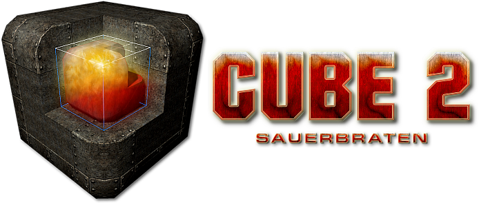

# Cube 2: Sauerbraten

## Links
First of all, welcome to Cube 2: Sauerbraten! To start off, if you are looking for help with the game itself, refer to the
	__Documentation__ below. Here are some places of interest on the internet, which are related to
	_Cube / Cube 2: Sauerbraten_.

* [Cube and Cube 2 Engines](http://cubeengine.com/): Start Page for the Cube Engine series.

* [Cube 2: Sauerbraten](http://sauerbraten.org/): The Sauerbraten FPS (First Person Shooter) Homepage.

* [Quadropolis](http://quadropolis.us/): Online Cube Engine community, with user made maps, mods, and scripts.

* [Sauerbraten IRC Channel](irc://irc.quakenet.org/sauerbraten): Online public chat with Cube developers, supporters and fans, via the [QuakeNet IRC Network](http://www.quakenet.org/).

* [Cube Forums](http://cubeengine.com/forum.php4): If after reading the documentation and wiki you still have any questions, you can try searching the forums. If your question isn't answered there, you can try posting to a relevant thread, or creating your own, being sure to supply a good description of your problem, and your operating system/hardware/software setup, while refraining from wild accusations.

## Documentation

Cube 2: Sauerbraten is a multiplayer/singleplayer FPS freeware game project.

The source code for the engine used in these games is Open Source (ZLIB licence, read the "License" section below carefully before starting ANY kind of project based on this engine).

You will want to read (roughly this order):

* [Game](docs/game.html): Information on gameplay.
* [Config](docs/config.html): How to run the game, configure it for your machine, and extend it with scripts.
* [Editing Tutorial](docs/editing.html): A guide to making maps.
* [Editing Reference](docs/editref.html): Map making reference.
* [Models](docs/models.html): How to put models into the game.
* [History](docs/history.html): For seeing latest changes.
* [Example RPG Game Information](docs/rpg.html): Information on running, building, or scripting the example RPG game.

## The Wiki

In addition to the documentation provided, the wiki has a lot of useful information for working
with the game and engine, contributed by the community which elaborates and breaks alot of the information
down into more digestable chunks. This is just provided a short rundown of the most useful topics to new players,
and those looking for quick readable information. For more go visit the
[Cube Wiki](http://cube.wikispaces.com/).

* [Beginners Guide](http://cube.wikispaces.com/Beginners+Guide): Go through the steps to get up and running.
* [Frequently Asked Questions](http://cube.wikispaces.com/FAQ): Get the answers to some commonly asked questions, like; "_The game runs very slowly, how can I fix it?_", "_Why is the game behaving strangely?_", and "_How do I fix the 'Hall of Mirrors' effect?_".
* [Performance Guide](http://cube.wikispaces.com/Performance+Guide): Things you can try to make the game either run faster or look better on your machine.
* [Older Stuff](http://quadropolis.us/taxonomy/term/21): From Quadropolis. 
* [Misc](docs/dev/wikistuff.html): Some old random documentation bits from our previous wiki that don't have a place yet.

## Current Features

Cube 2: Sauerbraten is an open source project, and maintains constant development, yet it is very feature-rich and playable as a game. What follows is a list of the most prominent features.

### Game Features

* Oldskool fast & intense gameplay (read: similar to Doom 2 / Quake 1).
* Many multiplayer gameplay modes, most in teamplay variants as well: deathmatch, instagib, efficiency, tactics, capture (domination/battlefield style), CTF (capture the flag), coop edit (!).
* Masterserver & ingame server browser.
* Lag-free gameplay experience.
* Two singleplayer modes: DMSP (fight a monster invasion on any DM map), classic SP (progression driven SP like other games)
* 7 weapons tuned for maximum satisfaction: double barrelled shogun, rocket launcher, machine gun, rifle, grenade launcher, pistol, fist.

### Engine Features

* 6 directional heightfield in octree world structure allowing for instant easy in-game geometry editing (even in multiplayer, coop edit).
* Rendering engine optimized for high geometry throughput, supporting hardware occlusion culling and software precomputed conservative PVS with occluder fusion.
* Lightmap based lighting with accurate shadows from everything including mapmodels, smooth lighting for faceted geometry, and fast compiles. Soft shadowmap based shadows for dynamic entities. 
* Pixel and vertex shader support, each model and world texture can have its own shader assigned. Supports normal and parallax mapping, specular and dynamic lighting with bloom and glow, environment-mapped and planar reflections/refractions, and post-process effects.
* Robust physics written specifically for this world structure.
* Loading of md2/md3/md5/obj/smd/iqm models for skeletal and vertex animated characters, weapons, items, and world objects. Supports animation blending, procedural pitch animation, and ragdoll physics for skeletally-animated characters.
* Network library designed for high speed games, client/server network system.
* Small but complete configuration/scripting language.
* Simple stereo positional sound system.
* Particle engine, supporting text particles, volumetric explosions, soft particles, and decals.
* 3d menu/gui system, for in-world representation of choices.

## Credits / Authors

### Programming

* Wouter "Aardappel" van Oortmerssen: A lot of the general code, and the original concept and design. ([website](http://strlen.com/))
* Lee "eihrul" Salzman: ENet networking library, *nix ports, and a lot of the general code, especially rendering/lightmaps/physics related. ([website](http://lee.fov120.com/))
* Mike "Gilt" Dysart: General programming, especially editing/physics related.
* Robert "baby-rabbit" Pointon: GUI, particle rendering, and movie recording code, MacOSX porting. ([website](http://www.fernlightning.com/))
* Quinton "quin" Reeves: Bots/AI code. Asissts with community management, documentation/wiki, and development. ([website](http://www.redeclipse.net/))

### Additional Code

* Julian Mayer: MacOSX ports.
* Adrian "driAn" Henke: MD3 code.
* Jerry Siebe: Geometry rendering optimisations.

### Level Design

* Kurt "kdoom" Kessler: A bunch of DM/capture maps, k_rpg1.
* Shane Nieb: academy, authentic, autumn, bt_falls, c_valley, complex, curvy_castle, flagstone, garden, hallo, hashi, island, justice, nevil_c, nmp4, nmp8, nmp9, ot, park, shipwreck, turbine
* John "metlslime" fitzgibbons: metl* maps.
* MitaMan: singleplayer episodes
* With additional maps by: Aardappel, driAn, Gilt, voot, Bryan "KillHour" Shalke, staffy, sparr, JCDPC, ZappaZ, RatBoy, Fanatic, rocknrol, KaiserTodretter, BlikjeBier, wurfel, aftasardem, Lazy [HUN], Gregor Koch, Junebug, Gabriele "Blindabuser" Magurno, MeatROme, TUX, Mayhem, mIscreant, schmutzwurst, Kal, DairyKing, Hero, WahnFred, jonlimle, and others.

### Art / Content

* John "Geartrooper" Siar: Mr. Fixit, Ironsnout, RPG characters, monsters, new hudguns and vweps.
* Gabriele "Blindabuser" Magurno: Logos, loading screen, announcer voices.
* MakkE: Mapmodels, old hudguns, items.
* Dietmar "dcp" Pier: Mapmodels, old hudguns.
* DarthVim: Old hudguns.
* Shane Nieb: Textures, Mapmodels, Skyboxes.
* Sock: The egyptian & tech texture sets ([website](http://www.planetquake.com/simland)).
* Iikka "Fingers" Keranen: The ikbase ik2k texture sets  ([website](http://www.digital-eel.com/surface)).
* Lunaran, Gibbie, Gregor Koch, Jésus "aftasardem" Maia, MitaMan, and philipk: Normalmapped texture sets. Additional art by: metlslime (textures), Than (textures), Remedy Entertainment Ltd (textures), Seth & Ulrich Galbraith (GPL models), Brian "EvilBastard" Collins, Conrad, Magarnigal, Psionic, James Green, Andreas Möller, Ryan Butts & Jeramy Cooke (md2 models), KaiserTodretter (items), Tentus (mapmodels), Kurt Kessler (mapmodels), Philip Klevestav (textures), leileilol/OpenArena (GPL bullet hole decal).

### Sound / Music

* Marc "Fanatic" A. Pullen: Soundtrack.

### Other

* Kristian "sleepwalkr" Duske: website / messageboard, hosting, master server.
* Pushplay: Documentation help.
* The SDL team: For their libraries ([website](http://www.libsdl.org/)).

## Building

Compiling the sources should be straight forward.

Unix users need to make sure to have the development version of all libs
installed (OpenGL, SDL, SDL_mixer, SDL_image, zlib). The included
Makefile can be used to build.

Windows users can use the included Visual Studio project files in the vcpp 
directory,  which references the lib/include directories for the external 
libraries and should thus be self contained. Release mode builds will place 
executables in the bin dir ready for testing and distribution.

An alternative to Visual Studio for Windows is MinGW/MSYS, which can be compiled
using the provided Makefile. Another alternative for Windows is to compile under
Code::Blocks with the provided vcpp/sauerbraten.cbp project file.

The Sauerbraten sources are very small, compact, and non-redundant, so anyone
wishing to modify the source code should be able to gain an overview of
Sauerbraten's inner workings by simply reading through the source code in its
entirety. Small amounts of comments should guide you through the more
tricky sections.

When reading the source code and trying to understand Sauerbaten's internal design,
keep in mind the goal of Cube: minimalism. I wanted to create a very complete
game / game engine with absolutely minimal means, and made a sport out of it
keeping the implementation small and simple. Sauerbraten is not a commercial 
product, it is merely the author's idea of a fun little programming project.